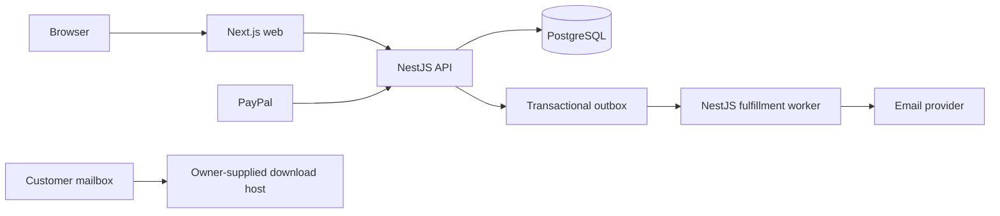
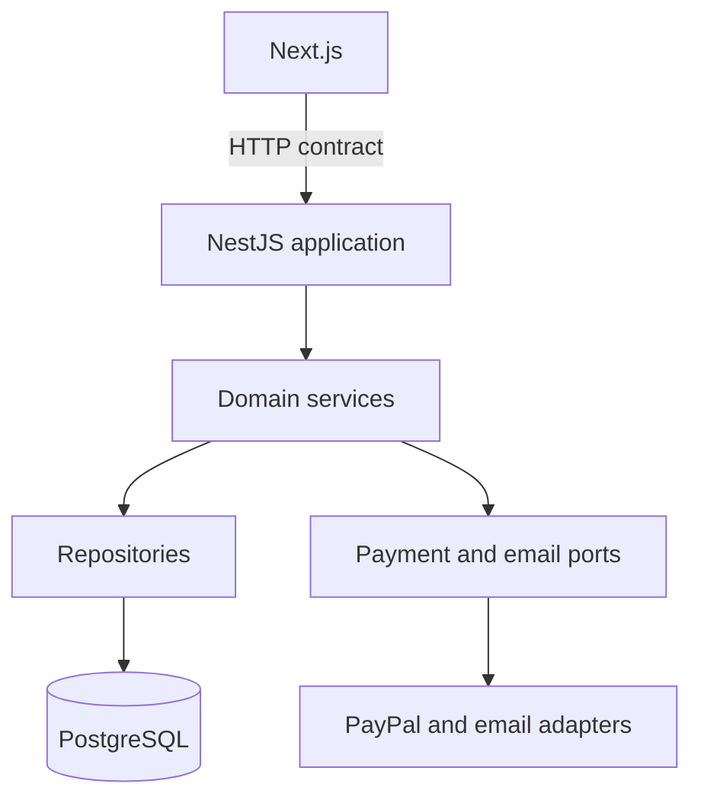

# Architecture Spine — Personal Website and IT Ebook Store

## Design Paradigm

Modular monolith with a Next.js web application and a NestJS application boundary over one PostgreSQL database. Next.js owns rendering and browser interaction; NestJS owns domain mutations, payment verification, admin authorization, and email fulfillment. A durable database outbox lets a worker retry email work without coupling payment confirmation to a provider request.

## Invariants & Rules

### AD-1 — NestJS owns domain state and mutations [ADOPTED]

- **Binds:** FR-4 through FR-14, NFR-1 through NFR-7
- **Prevents:** Next.js server actions, webhooks, and admin screens each becoming a competing owner of Orders or Books
- **Rule:** All Book, Order, payment, Email attempt, personal-information, blog, and Affiliate link writes go through NestJS application services and repository interfaces. Next.js may read public data through the API or approved server-side client, but never writes the database directly.

### AD-2 — Payment verification is server-authoritative and idempotent [ADOPTED]

- **Binds:** FR-5, FR-6, FR-7, NFR-1, NFR-3
- **Prevents:** forged browser success, price tampering, duplicate Orders, or duplicate fulfillment after PayPal retries
- **Rule:** Create an Order from the server-side Book price. Capture/reconcile PayPal on NestJS. Accept a completion only when the PayPal order/payment reference, merchant, amount, currency, and local Order agree. Enforce unique provider references and idempotent state transitions before enqueueing fulfillment.

### AD-3 — Email fulfillment is a durable outbox workflow [ADOPTED]

- **Binds:** FR-7, FR-11, NFR-3, NFR-7
- **Prevents:** a paid Order disappearing when email is unavailable, or a retry sending an untracked duplicate
- **Rule:** In the same database transaction that records verified payment, create one fulfillment job keyed by Order and attempt. A worker claims pending jobs with a lease, sends through the selected provider, records provider outcome and timestamps, and retries only according to the attempt policy. Unknown provider outcomes remain unknown and visible; an Admin resend creates a new explicit Email attempt.

### AD-4 — Order snapshots preserve the commercial event [ADOPTED]

- **Binds:** FR-6, FR-7, FR-9, FR-10
- **Prevents:** later Book edits changing historical price, title, recipient, or Download link unexpectedly
- **Rule:** An Order stores immutable snapshots of Book title, price, currency, checkout email, phone, and Download link selected for fulfillment. Current Book records remain editable; historical Order fields are never rewritten by catalog edits.

### AD-5 — Public, checkout, and admin data have separate exposure rules [ADOPTED]

- **Binds:** FR-1 through FR-15, NFR-2, NFR-5
- **Prevents:** exposing customer contact data, admin records, or paid links through public pages or browser bundles
- **Rule:** Public DTOs contain only published content and catalog fields. Admin DTOs require owner authorization. Secrets, provider credentials, raw session identifiers, and internal error details never enter browser responses or general logs. Download links are returned only in fulfillment/admin contexts defined by the API.

### AD-6 — Owner admin sessions are server-held cookies [ADOPTED]

- **Binds:** FR-8, NFR-2
- **Prevents:** admin tokens leaking through local storage, URLs, or cross-site state-changing requests
- **Rule:** Use a server-side session identifier in a `__Host-` Secure, HttpOnly, SameSite cookie over HTTPS. Apply CSRF protection and Origin checks to state-changing admin requests. NestJS guards authorize every protected handler; Next.js middleware only improves navigation and never replaces API authorization.

### AD-7 — One API contract and one error vocabulary cross the boundary [ADOPTED]

- **Binds:** all FRs and companions
- **Prevents:** Next.js and NestJS disagreeing on validation, IDs, payment states, or error handling
- **Rule:** Define DTOs and API error codes in a shared TypeScript package generated or reviewed from the NestJS contract. IDs are opaque strings; timestamps are ISO 8601 UTC; money uses integer minor units plus ISO currency; client-visible states use the glossary terms in the PRD. Breaking contract changes require a versioned migration.

### AD-8 — External providers are adapters behind application ports [ADOPTED]

- **Binds:** FR-6, FR-7, NFR-3, provider integrations
- **Prevents:** PayPal, email, or file-host details spreading through domain logic and blocking later replacement
- **Rule:** Domain services call `PaymentGateway`, `EmailSender`, and `Clock` ports. PayPal webhooks/capture and the selected email provider translate into those ports. Provider verification, signatures, timeouts, and raw payload retention are isolated in adapter modules.

### AD-9 — Same-origin deployment is the initial boundary [ADOPTED]

- **Binds:** public/admin browser flows, authentication, CORS and cookies
- **Prevents:** cross-origin cookie and CSRF drift between the website and API
- **Rule:** Serve Next.js and NestJS behind one HTTPS origin. Route `/api/*` to NestJS and the page routes to Next.js through a reverse proxy. Keep the deployment topology replaceable; a separate origin requires a documented CORS, cookie, and CSRF review before adoption.

## Consistency Conventions

| Concern | Convention |
|---|---|
| Naming | TypeScript `camelCase` fields, `PascalCase` classes, plural REST resources, domain terms Book/Order/EmailAttempt/AffiliateLink |
| Data and money | PostgreSQL `timestamptz`; UTC at boundaries; integer minor units and ISO currency; opaque UUID/ULID-style IDs; SQL migrations committed and reviewed |
| State | Explicit payment and email state machines; transitions validated in NestJS services; no client-driven state mutation |
| Errors | Stable `code`, human-safe `message`, optional field errors, correlation ID; no provider secrets or stack traces |
| Events and jobs | Transactional outbox rows with unique idempotency keys; leases and retry metadata; provider callbacks are duplicate-safe |
| Configuration | Environment variables validated at startup; secrets only in deployment secret storage; no secrets in the repository |
| Observability | Structured logs with correlation ID and redacted email/phone; metrics for payment reconciliation, fulfillment latency, and email outcomes |

## Stack

These are cold-start pins/ranges verified against official documentation or release metadata on 2026-09-15; dependency lockfiles own exact patch versions once installed.

| Name | Version |
|---|---|
| Node.js | 24.x LTS (minimum Next.js documentation requirement is 20.9) |
| Next.js + React | Next.js 16.x current line; React version supplied by the selected Next release |
| NestJS | 12.x current line |
| TypeScript | 5.x, strict mode |
| PostgreSQL | 18.x current line |
| PostgreSQL client | `pg` 8.x current line |
| Package manager | pnpm 12.x |
| Payment | PayPal Orders v2 + webhooks adapter |
| UI | Tailwind CSS current line + accessible headless primitives selected during implementation |

## Structural Seed



```text
book-ai-project/
  apps/web/       # Next.js public and admin surfaces
  apps/api/       # NestJS modules, API, provider adapters, worker
  packages/contracts/ # shared DTOs, error codes, state names
  packages/config/    # validated non-secret configuration schema
  db/migrations/      # reviewed PostgreSQL migrations
```

### Ownership boundaries



## Capability → Architecture Map

| Capability | Lives in | Governed by |
|---|---|---|
| Public info/blog/affiliate/catalog | Next.js read surfaces + NestJS public query modules | AD-1, AD-5, AD-7 |
| Guest checkout | Next.js checkout + NestJS Orders module | AD-1, AD-2, AD-7 |
| PayPal capture/webhook reconciliation | NestJS Payments + PayPal adapter | AD-2, AD-8 |
| Email delivery/history/resend | NestJS Fulfillment, outbox worker, Email adapter | AD-3, AD-8 |
| Admin Books/Orders/Emails/content | Next.js admin + NestJS admin modules | AD-1, AD-5, AD-6 |
| Persistence and recovery | PostgreSQL migrations, repositories, outbox leases | AD-3, AD-4, conventions |

## Deferred

- Exact Next.js/NestJS patch versions and lockfile: set during repository bootstrap and CI.
- Exact UI primitive library, email provider, hosting, reverse proxy, backups, alerting, and log retention: select during implementation architecture with current service constraints.
- Prisma versus direct SQL was intentionally not adopted; this spine uses PostgreSQL and `pg` with reviewed SQL migrations to avoid binding an unverified ORM release line.
- Admin credential/recovery UX, privacy/retention policy, taxes/refunds, PayPal account-country readiness, and sender-domain verification remain launch prerequisites from the PRD.
- Protected download tokens, expiry, revocation, automated file hosting, carts, customer accounts, multiple admins, and additional locales remain deferred product scope.
